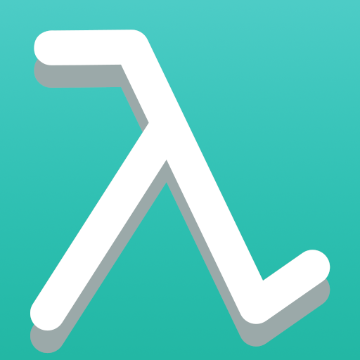
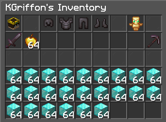

# Lambda

---

Lambda is a **server-side** mod that adds various commands.  
Feel free to suggest other commands on [GitHub](https://github.com/kgriff0n/lambda) or [Discord](https://discord.gg/ZeHm57BEyt)!
 

## Config

---
You can find `lambda.properties` file in the config folder. This file allows you to change to text ouput of the commands.
This mod uses [fabric-permissions-api](https://github.com/lucko/fabric-permissions-api), so you can easily manage permissions with any compatible permission manager mod.

## Commands list

---

### Utility commands

| Command        | Arguments | Description                                  | Permission                |
|:---------------|:---------:|----------------------------------------------|---------------------------|
| `/anvil`       |     -     | opens an anvil                               | *lamba.util.anvil*        |
| `/cartography` |     -     | opens a cartography table                    | *lamba.util.cartography*  | 
| `/craft`       |     -     | opens a crafting table                       | *lamba.util.craft*        |
| `/disposal`    |     -     | opens a trash to destroy your items          | *lamba.util.disposal*     |
| `/enchanting`  |     -     | opens an enchanting table                    | *lamba.util.enchanting*   |
| `/ec`          |     -     | opens your enderchest                        | *lamba.util.&#8203;ec*    |
| `/enderchest`  |     -     | opens your enderchest                        | *lamba.util.enderchest*   |
| `/grindstone`  |     -     | opens a grindstone                           | *lamba.util.grindstone*   |
| `/loom`        |     -     | opens a loom                                 | *lamba.util.loom*         |
| `/r`           |     -     | reply to your last recipient                 | *lamba.util.reply*        |
| `/smithing`    |     -     | opens a smithing table                       | *lamba.util.smithing*     |
| `/stonecutter` |     -     | opens a stonecutter                          | *lamba.util.stonecutter*  |
| `/top`         |     -     | teleports you to the highest block above you | *lamba.util.top*          |
| `/trash`       |     -     | opens a trash to destroy your items          | *lamba.util.trash*        |

 
 

### Miscellaneous commands

| Command      |      Arguments       | Description                           | Permission              |
|:-------------|:--------------------:|---------------------------------------|-------------------------|
| `/coinflip`  | selection of players | throws a coin                         | *lambda.misc.coinflip*  |
| `/hat`       |          -           | puts your selected item on your head  | *lambda.misc.hat*       |
| `/head`      |     player name      | get the head of a specified player    | *lambda.misc.head*      |
| `/lightning` | selection of players | strikes players with a lightning bolt | *lambda.misc.lightning* |
| `/skull`     |     player name      | get the head of the given player      | *lambda.misc.skull*     |

 
 

### Administrator commands

| Command      |      Arguments       | Description                                                                                             | Permission                                             |
|:-------------|:--------------------:|---------------------------------------------------------------------------------------------------------|--------------------------------------------------------|
| `/broadcast` | selection of players | displays a message in the chat (support `&` for color codes)[1](#code-format)                | *lambda.admin.broadcast*                               |
| `/ecsee`     |   a single player    | allows you to open another player enderchest, and manage its contents                                   | *lambda.admin.ecsee*                                   |
| `/feed`      |   a single player    | feeds a specified player                                                                                | *lambda.admin.feed*                                    |
| `/fly`       |   a single player    | toggles fly of the specified player                                                                     | *lambda.admin.fly*                                     |
| `/heal`      |   a single player    | heals a specified player                                                                                | *lambda.admin.heal*                                    |
| `/invsee`    |   a single player    | allows you to open another player's inventory[2](#invsee-interface), and manage its contents | *lambda.admin.invsee*                                  |
| `/lambda`    |  `ìnfo` or `reload`  | get mod information, and reload configuration file                                                      | *lambda.admin.&#8203;info*   *lambda.admin.reload* |

 

Footnotes

<a name="code-format">1</a>  
Add `&` before these characters to get the right color  

<a name="invsee-interface">2</a>  

